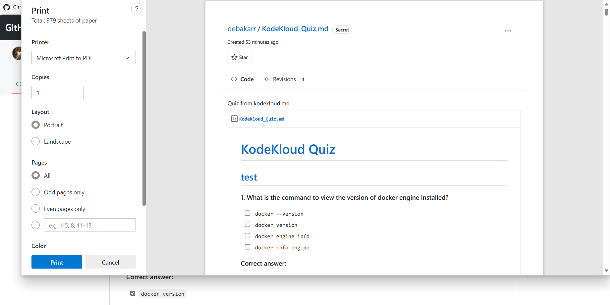

# KodeKloud Downloader

## Disclaimer
Please read the following disclaimer carefully before using the Downloader CLI Tool.

- The CLI Tool is intended for personal use only. By using this tool, you agree to use it at your own risk and assume full responsibility for any consequences that may arise from its use. The developers and contributors of this tool are not responsible for any damages or losses that may occur from its use.

- The use of this tool to download premium courses is for educational purposes only. You must have the proper authorization or permission from the course provider to access the content legally.

- It is strictly prohibited to distribute or share the downloaded content through any means, including but not limited to uploading to file-sharing platforms, torrent sites, or any other form of digital or physical distribution. Doing so is a violation of copyright laws and may result in legal consequences.

---

## Features

- [x] Download video lessons in selected quality
- [x] Organizes downloaded content in a structured folder hierarchy
- [x] Download resources (PDFs, etc.) alongside video lessons

---

## Prerequisites

- **User need to enroll in the course before using the cli tool to download it**
- Python 3.8 or higher
- ffmpeg

<details>
    <summary>How to Install FFmpeg on Linux, Mac, and Windows</summary>

# How to Install FFmpeg on Linux, Mac, and Windows

FFmpeg is a powerful and flexible multimedia processing tool that can handle a wide range of tasks, such as video and audio conversion, streaming, and recording. In this guide, we will show you how to install FFmpeg on Linux, Mac, and Windows operating systems.

## Linux

### Ubuntu and Debian-based distributions

1.  Update the package lists for upgrades and new package installations.

`sudo apt update`

1.  Install FFmpeg using the following command:

`sudo apt install ffmpeg`

### Fedora

1.  Install FFmpeg using the following command:

`sudo dnf install ffmpeg`

### Arch Linux and Manjaro

1.  Install FFmpeg using the following command:

`sudo pacman -S ffmpeg`

## Mac

### Using Homebrew

If you don't have Homebrew installed, you can install it by following the instructions on the [official Homebrew website](https://brew.sh/).

Update Homebrew to ensure you have the latest package information:

`brew update`

1.  Install FFmpeg using the following command:

`brew install ffmpeg`

### Using MacPorts

If you don't have MacPorts installed, you can install it by following the instructions on the [official MacPorts website](https://www.macports.org/install.php).

Update MacPorts to ensure you have the latest package information:

`sudo port selfupdate`

1.  Install FFmpeg using the following command:

`sudo port install ffmpeg`

## Windows

### Using Chocolatey

If you don't have Chocolatey installed, you can install it by following the instructions on the [official Chocolatey website](https://chocolatey.org/install).

Open an elevated Command Prompt (run as Administrator) and install FFmpeg using the following command:

`choco install ffmpeg`

### Using Scoop

If you don't have Scoop installed, you can install it by following the instructions on the [official Scoop website](https://scoop.sh/).

Open a PowerShell terminal and install FFmpeg using the following command:

`scoop install ffmpeg`

After following these steps, FFmpeg should be installed on your system. You can check the installation by running the following command in your terminal or command prompt:

`ffmpeg -version`

This will display the FFmpeg version and build information, confirming that the installation was successful.

</details>


## How to get cookie
- Sign in to kodekloud.com
- Download extension such as [Get cookies.txt LOCALLY](https://chrome.google.com/webstore/detail/get-cookiestxt-locally/cclelndahbckbenkjhflpdbgdldlbecc/related)
- Download the cookie and save it in some location (You can name it something like `cookie.txt`).


## 💻 Installation

To install kodekloud-downloader, simply run the following command:

```console
pip install -U kodekloud-downloader
```

You can also install the latest main changes:
```console
pip install -U git+https://github.com/debakarr/kodekloud-downloader.git
```

## Try in Browser
[](https://colab.research.google.com/drive/1GsgFcqa_43GYeDKmoa0CXsRfDySrzvzT?usp=sharing)

## 📚 Usage

After installing the package, you can use the `kodekloud dl` command to download shows from the command line.

```css
kodekloud dl --help
Usage: kodekloud dl [OPTIONS] [COURSE_URL]

Options:
  -q, --quality [360p|480p|540p|720p|1080p]
                                  Quality of the video to be downloaded.
  -o, --output-dir TEXT           Output directory where downloaded files will
                                  be store.
  -c, --cookie TEXT               Cookie to download the courses.  [required]
  --help                          Show this message and exit.
```

Here is an example:

### 🔍 Download entire course from list of available course in current folder

```css
kodekloud dl -o . -c /path/to/cookie.txt
+-----+--------------------------------------------------------------------------------------+----------+------------------------------------------------------------------------------------------+
| No. | Name                                                                                 | Type     | Categories                                                                               |
+-----+--------------------------------------------------------------------------------------+----------+------------------------------------------------------------------------------------------+
| 1   | Kubernetes Administration: Package Management with Glasskube                         | Standard | Kubernetes                                                                               |
| 2   | Linux System Administration for Beginners                                            | Standard |                                                                                          |
| 3   | GKE - Google Kubernetes Engine                                                       | Standard | Cloud, Containers, DevOps, Kubernetes, Container Orchestration, GCP                      |
| 4   | DevOps Interview Preparation Course                                                  | Standard | DevOps                                                                                   |
| 5   | Kustomize                                                                            | Standard | DevOps, Kubernetes                                                                       |
| 6   | AWS Lambda                                                                           | Pro      | AWS, Cloud                                                                               |
| 7   | AWS Solutions Architect Associate Certification                                      | Pro      | AWS, Certification, Cloud                                                                |
| 8   | Amazon Elastic Compute Cloud (EC2)                                                   | Pro      | AWS, Cloud, DevOps, Infrastructure as Code (IaC)                                         |
| 9   | Learn By Doing: HashiCorp Nomad                                                      | Standard | HashiCorp                                                                                |
| 10  | GIT for Beginners                                                                    | Standard | DevOps, Programming                                                                      |
| 11  | Spacelift: Elevate Your Infrastructure Deployment                                    | Standard | DevOps, Infrastructure as Code (IaC)                                                     |
| 12  | Introduction to Sealed Secrets in Kubernetes                                         | Standard | Kubernetes                                                                               |
| 13  | Learn by Doing - Prompt Engineering 101                                              | Free     |                                                                                          |
| 14  | Prometheus Certified Associate (PCA)                                                 | Standard | Certification, DevOps, Kubernetes, Monitoring                                            |
| 15  | Learning Linux Basics Course & Labs                                                  | Standard | Linux, DevOps                                                                            |
| 16  | Helm for Beginners                                                                   | Standard | DevOps, Kubernetes, Container Orchestration, Containers                                  |
| 17  | Exploring WebAssembly (WASM)                                                         | Standard | DevOps, Cloud                                                                            |
| 18  | Docker Certified Associate Exam Course                                               | Standard | Certification, Containers, DevOps                                                        |
| 19  | HashiCorp Packer                                                                     | Standard | DevOps, HashiCorp                                                                        |
| 20  | Learn By Doing: AWS Workshop with Terraform                                          | Standard | AWS, Infrastructure as Code (IaC)                                                        |
| 21  | Kubernetes and Cloud-Native Associate (KCNA)                                         | Standard | Certification, Containers, Kubernetes, Container Orchestration                           |
| 22  | DP-900: Microsoft Azure Data Fundamentals                                            | Standard | Certification, Cloud                                                                     |
| 23  | Learn Ansible Basics - Beginners Course                                              | Standard | Automation, DevOps, Infrastructure as Code (IaC)                                         |
| 24  | Ultimate Certified Kubernetes Administrator (CKA) Mock Exam Series                   | Standard | Challenges, Containers, Kubernetes                                                       |
| 25  | 12 Factor App                                                                        | Standard |                                                                                          |
| 26  | Docker - SWARM | SERVICES | STACKS - Hands-on                                        | Standard | Containers, DevOps                                                                       |
| 27  | Fundamentals of DevOps                                                               | Standard | DevOps                                                                                   |
| 28  | Kubernetes Networking Deep Dive                                                      | Standard | Kubernetes                                                                               |
| 29  | Terraform Basics Training Course                                                     | Standard | Automation, DevOps, Infrastructure as Code (IaC)                                         |
| 30  | CKA Certification Course - Certified Kubernetes Administrator                        | Standard | Containers, Certification, Container Orchestration, DevOps, Kubernetes                   |
| 31  | Chaos Engineering                                                                    | Standard | AWS                                                                                      |
| 32  | Mastering Generative AI with OpenAI                                                  | Standard | Programming                                                                              |
| 33  | Kubernetes Challenges                                                                | Free     | Containers, DevOps, Kubernetes                                                           |
| 34  | HashiCorp Certified: Vault Associate Certification                                   | Standard | Certification, DevOps, HashiCorp                                                         |
| 35  | OpenTofu: A Beginners Guide to a Terraform Fork Including Migration From Terraform   | Standard | DevOps, Infrastructure as Code (IaC)                                                     |
| 36  | Ultimate Certified Kubernetes Application Developer (CKAD) Mock Exam Series          | Standard | Challenges, Containers, Kubernetes                                                       |
| 37  | Learn By Doing: Deploying and Managing the EFK Stack on Kubernetes                   | Standard | DevOps, Kubernetes                                                                       |
| 38  | Grafana Loki                                                                         | Standard | DevOps, Kubernetes, Monitoring                                                           |
| 39  | Linode : Kubernetes Engine                                                           | Free     | Containers, Kubernetes                                                                   |
| 40  | Microsoft Azure Security Technologies (AZ-500)                                       | Standard | Certification, Cloud, Security                                                           |
| 41  | Learn-By-Doing Kubernetes Network Policies                                           | Standard | Challenges, Containers, Kubernetes, Container Orchestration                              |
| 42  | Kubernetes for the Absolute Beginners - Hands-on Tutorial                            | Standard | Containers, DevOps, Kubernetes, Container Orchestration                                  |
| 43  | HashiCorp : Terraform Cloud                                                          | Standard | Cloud, DevOps, HashiCorp                                                                 |
| 44  | AWS RDS                                                                              | Pro      | AWS, Cloud                                                                               |
| 45  | AWS Networking Fundamentals                                                          | Pro      | AWS                                                                                      |
| 46  | Istio Service Mesh                                                                   | Standard | DevOps, Kubernetes                                                                       |
| 47  | Learn By Doing: Kubernetes Policies with Kyverno                                     | Standard | DevOps, Kubernetes                                                                       |
| 48  | Docker Training Course for the Absolute Beginner                                     | Free     | DevOps, Containers                                                                       |
| 49  | GitLab CI/CD: Architecting, Deploying, and Optimizing Pipelines                      | Standard | CI/CD                                                                                    |
| 50  | AWS Cloud Practitioner (CLF-C02)                                                     | Standard | AWS, Cloud, DevOps                                                                       |
| 51  | GitHub Actions                                                                       | Standard | Automation                                                                               |
| 52  | OpenShift 3 for the Absolute Beginners                                               | Standard | Container Orchestration, Containers, DevOps                                              |
| 53  | Linux Foundation Certified System Administrator (LFCS)                               | Standard | DevOps, Linux, Certification                                                             |
| 54  | DevOps Pre-Requisite Course                                                          | Standard | DevOps                                                                                   |
| 55  | Linux Challenges                                                                     | Free     | DevOps, Linux                                                                            |
| 56  | GitOps with FluxCD                                                                   | Standard | CI/CD, DevOps, Kubernetes                                                                |
| 57  | Amazon Simple Storage Service (Amazon S3)                                            | Pro      | AWS, Cloud                                                                               |
| 58  | Postman Essentials                                                                   | Standard | DevOps                                                                                   |
| 59  | GCP DevOps Project                                                                   | Standard | Cloud, GCP                                                                               |
| 60  | Lens - Kubernetes IDE                                                                | Free     | Kubernetes                                                                               |
| 61  | Python Basics                                                                        | Standard | Certification, DevOps, Programming, Python                                               |
| 62  | [Updated] AZ-104: Microsoft Azure Administrator                                      | Standard | Certification, DevOps, Cloud                                                             |
| 63  | Hands-On AWS Project: Deploy Your First Crypto App                                   | Pro      | AWS                                                                                      |
| 64  | Shell Scripts for Beginners                                                          | Standard | Challenges, DevOps                                                                       |
| 65  | CKS - Challenges                                                                     | Free     | Challenges, Containers, Container Orchestration, DevOps                                  |
| 66  | DevSecOps - Kubernetes DevOps & Security                                             | Standard | DevOps, DevSecOps, Kubernetes                                                            |
| 67  | OpenShift 4                                                                          | Standard | Container Orchestration, DevOps, Red Hat                                                 |
| 68  | AWS - IAM                                                                            | Pro      | AWS, Cloud                                                                               |
| 69  | HashiCorp Certified: Consul Associate Certification                                  | Standard | Certification, DevOps, HashiCorp                                                         |
| 70  | Jinja2 Basics (Mini Course)                                                          | Free     | DevOps                                                                                   |
| 71  | Open Source for Beginners                                                            | Standard |                                                                                          |
| 72  | GitOps with ArgoCD                                                                   | Standard | DevOps, Kubernetes, CI/CD                                                                |
| 73  | EFK Stack: Enterprise-Grade Logging and Monitoring                                   | Standard | Certification                                                                            |
| 74  | AWS CloudWatch                                                                       | Pro      | AWS, Cloud, Monitoring                                                                   |
| 75  | Linux Professional Institute LPIC-1 Exam 101                                         | Standard | Certification, Linux                                                                     |
| 76  | Terraform Associate Certification: HashiCorp Certified                               | Standard | Certification, Container Orchestration, Containers, DevOps, Infrastructure as Code (IaC) |
| 77  | GCP Cloud Digital Leader Certification                                               | Standard | Certification, Cloud, GCP                                                                |
| 78  | AZ900: Microsoft Azure Fundamentals                                                  | Standard | Certification, Cloud                                                                     |
| 79  | Learn By Doing - MariaDB                                                             | Standard |                                                                                          |
| 80  | Amazon Elastic Container Service (AWS ECS)                                           | Free     | AWS, Cloud, DevOps                                                                       |
| 81  | Golang                                                                               | Standard | DevOps, Programming                                                                      |
| 82  | AWS EKS                                                                              | Pro      | AWS, Cloud                                                                               |
| 83  | GitHub Actions Certification                                                         | Standard | Automation                                                                               |
| 84  | Enhancing Soft Skills for DevOps Engineers: Essential Non-Technical Skills to Thrive | Standard | DevOps                                                                                   |
| 85  | JSON Path Test - Free Course                                                         | Free     | DevOps                                                                                   |
| 86  | Terragrunt for Beginners                                                             | Standard | DevOps, Infrastructure as Code (IaC)                                                     |
| 87  | Introduction to K8sGPT and AI-Driven Kubernetes Engineering                          | Standard | DevOps, Kubernetes                                                                       |
| 88  | HashiCorp Certified: Vault Operations Professional 2022                              | Standard | Certification, DevOps, HashiCorp, Container Orchestration, Containers                    |
| 89  | AWS CodePipeline (CI/CD Pipeline)                                                    | Pro      | AWS, Cloud, DevOps                                                                       |
| 90  | LangChain                                                                            | Standard | Programming                                                                              |
| 91  | Ansible Advanced Course                                                              | Standard | Automation, DevOps, Infrastructure as Code (IaC)                                         |
| 92  | Certified Kubernetes Security Specialist (CKS)                                       | Standard | Containers, DevOps, Kubernetes, Certification, Container Orchestration                   |
| 93  | Pulumi Essentials                                                                    | Standard | DevOps, Infrastructure as Code (IaC)                                                     |
| 94  | Certified Kubernetes Application Developer (CKAD)                                    | Standard | Containers, DevOps, Kubernetes, Certification, Container Orchestration                   |
| 95  | Jenkins                                                                              | Standard | CI/CD, DevOps, Automation                                                                |
| 96  | Advanced Bash Scripting                                                              | Standard | Linux                                                                                    |
| 97  | PCAP - Python Certification Course                                                   | Standard | Certification, DevOps, Programming, Python                                               |
| 98  | Advanced Golang                                                                      | Standard | Programming                                                                              |
| 99  | Azure Kubernetes Service                                                             | Standard | Cloud, DevOps, Kubernetes                                                                |
| 100 | AZ-305: Microsoft Azure Solutions Architect Expert                                   | Standard | Certification, Cloud, DevOps                                                             |
| 101 | Terraform Challenges                                                                 | Free     | Containers, DevOps, Infrastructure as Code (IaC)                                         |
| 102 | CKA Certification Course - Certified Kubernetes Administrator                        | Standard | Containers, Certification, Container Orchestration, DevOps, Kubernetes                   |
| 103 | AWS Certified Developer - Associate                                                  | Pro      | AWS, Certification, Cloud                                                                |
+-----+--------------------------------------------------------------------------------------+----------+------------------------------------------------------------------------------------------+
Enter the courses you want to select (Multiple courses can be passes using this format 1,6-9,10-11): 1-3,7-9,10,13,55
```


You can also use `kodekloud dl-quiz` to download all quiz in a markdown file.

```css
kodekloud dl-quiz --help
Usage: kodekloud dl-quiz [OPTIONS]

Options:
  -o, --output-dir TEXT  Output directory where quiz markdown file will be
                         saved.
  --sep                  Write in seperate markdown files.
  --help                 Show this message and exit.
```

Here is an example:

`kodekloud dl-quiz -o KodeKloudQuiz`

or download seperate markdown file.

`kodekloud dl-quiz -o KodeKloudQuiz --sep`

To convert the quiz markdown to PDF you can use any online PDF converter like [aconvert](https://www.aconvert.com/pdf/md-to-pdf/), or [md2pdf](https://md2pdf.netlify.app/). You can also use [`grip`](https://github.com/joeyespo/grip). Or you can also create a [GitHub Gist](https://gist.github.com/) and then use your browser to convert the page into PDF.



## Colab Notebook to download directly in Personal GDrive

You can open [this notebook](https://colab.research.google.com/drive/1GsgFcqa_43GYeDKmoa0CXsRfDySrzvzT?usp=sharing) with your google account were you want to download the course. Please note that you should open with the same account for which you want to link the drive.
